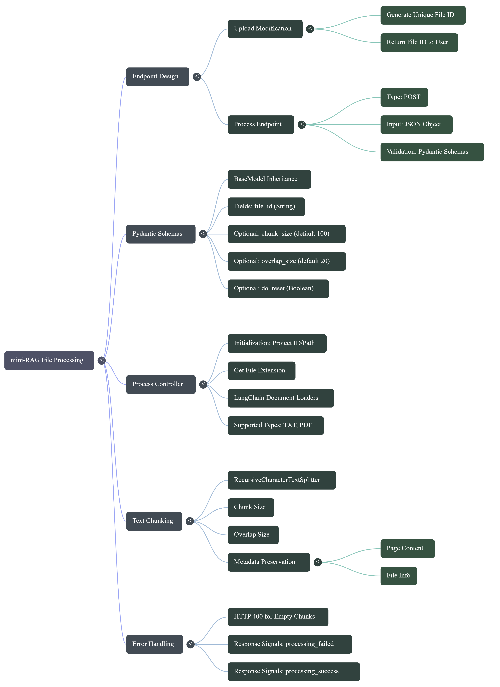

```
├── assets
│   └── Mini-RAG.json
├── controllers
│   ├── BaseController.py
│   ├── DataController.py
│   ├── ProcessController.py            # for handling file processing logic (loading + chunking) (e.g., get_file_extension, process_file_content)
│   ├── ProjectController.py
│   └── __init__.py
├── core
│   ├── __init__.py
│   └── configs.py
├── models
│   ├── enums
│   │   ├── ProcessingEnum.py           # for defining supported file types and other processing-related enums [pdf, txt]
│   │   ├── ResponseEnums.py
│   │   └── __init__.py
│   └── __init__.py
├── routes
│   ├── schemas
│   │   ├── __init__.py
│   │   └── data_schema.py              # for defining request/response schemas related to data processing (e.g., ProcessRequest with file_id, chunk_size, overlap_size)
│   ├── __init__.py
│   ├── base.py
│   └── data.py
├── .env.example
├── .gitignore
├── main.py
└── requirements.txt
```

<div style="width: 100%; height: 30px; background: linear-gradient(to right, rgb(235, 238, 212), rgb(235, 238, 212));"></div>



<div style="width: 100%; height: 30px; background: linear-gradient(to right, rgb(235, 238, 212), rgb(235, 238, 212));"></div>

## **ProcessController.py**
```py
from .BaseController import BaseController
from .ProjectController import ProjectController
from langchain_community.document_loaders import TextLoader, PyMuPDFLoader
from langchain_text_splitters import RecursiveCharacterTextSplitter
from models import ProcessingEnum
import os


class ProcessController(BaseController):
    def __init__(self, project_id: str):
        super().__init__()
        self.project_id = project_id
        self.project_controller = ProjectController()
        self.project_path = self.project_controller.get_project_path(project_id=project_id)

    # ------------------ Get file extension from file_id ------------------
    def get_file_extension(self, file_id: str):
        return os.path.splitext(file_id)[-1]

    # ------------------ Validate file_id and return full path ------------------
    def validate_file_id(self, file_id: str) -> str:
        """Validate file_id and return full path."""
        # 1. check for unsafe characters to prevent path traversal
        if ".." in file_id or "/" in file_id or "\\" in file_id:
            raise ValueError(f"Invalid file_id: contains unsafe characters")
        # 2. build the full path
        file_path = os.path.join(self.project_path, file_id)
        # 3. check if the file exists
        if not os.path.exists(file_path):
            raise FileNotFoundError(f"File not found: {file_id}")
        # 4. check that the path is within project_path (extra security)
        if not os.path.abspath(file_path).startswith(os.path.abspath(self.project_path)):
            raise ValueError(f"Invalid file_id: path traversal detected")
        return file_path

    # ------------------ Get appropriate file loader based on file extension ------------------
    def get_file_loader(self, file_id: str):
        file_path = self.validate_file_id(file_id)
        file_ext = self.get_file_extension(file_id=file_id)
        if file_ext == ProcessingEnum.TXT.value:
            return TextLoader(file_path, encoding="utf-8")
        if file_ext == ProcessingEnum.PDF.value:
            return PyMuPDFLoader(file_path)
        return None

    # ------------------ Load file content using the appropriate loader ------------------
    def get_file_content(self, file_id: str):
        try:
            loader = self.get_file_loader(file_id=file_id)
            if loader is None:
                raise ValueError(f"Unsupported file type: {file_id}")
            return loader.load()
        except FileNotFoundError:
            raise FileNotFoundError(f"File not found: {file_id}")
        except Exception as e:
            raise Exception(f"Failed to load file content: {str(e)}")

    # ------------------ Process file content into chunks with metadata ------------------
    def process_file_content(
        self,
        file_content: list,
        file_id: str,
        chunk_size: int | None = None,
        overlap_size: int | None = None,
    ):
        chunk_size = chunk_size or self.settings.CHUNK_SIZE_DEFAULT
        overlap_size = overlap_size or self.settings.OVERLAP_SIZE_DEFAULT
        text_splitter = RecursiveCharacterTextSplitter(
            chunk_size=chunk_size,
            chunk_overlap=overlap_size,
            length_function=len,
        )
        texts = [doc.page_content for doc in file_content]
        metadatas = [doc.metadata for doc in file_content]
        for meta in metadatas:
            meta["file_id"] = file_id
        chunks = text_splitter.create_documents(texts, metadatas=metadatas)
        return chunks
```

## **configs.py**
```py
from pydantic_settings import BaseSettings


class Settings(BaseSettings):
    # ------------------ Application Configuration ------------------
    APP_NAME: str = "Mini-RAG"
    APP_VERSION: str = "0.1.0"
    APP_DESCRIPTION: str = "A mini RAG application for demo purposes."
    ENVIRONMENT: str = "local"

    # ------------------ File Upload Configuration ------------------
    FILE_ALLOWED_TYPES: list[str] = ["text/plain", "application/pdf"]
    FILE_MAX_SIZE: int = 10
    FILE_DEFAULT_CHUNK_SIZE: int = 512000  # bytes for reading uploaded files
    FILE_MAX_SIZE_SCALE: int = 1048576  # MB to bytes conversion (1MB = 1048576 bytes)
    CHUNK_SIZE_DEFAULT: int = 800
    OVERLAP_SIZE_DEFAULT: int = 100

    class Config:
        env_file = ".env"


def get_settings():
    return Settings()
```

## **models/enums/ResponseEnums.py**
```py
from enum import Enum


class ResponseSignal(Enum):
    # ------------------ Health check signals ------------------
    STATUS_HEALTHY = "healthy"
    STATUS_UNHEALTHY = "unhealthy"

    # ------------------ File upload signals ------------------
    FILE_VALIDATED_SUCCESS = "file_validate_successfully"
    FILE_TYPE_NOT_SUPPORTED = "file_type_not_supported"
    FILE_SIZE_EXCEEDED = "file_size_exceeded"
    FILE_UPLOAD_SUCCESS = "file_upload_success"
    FILE_UPLOAD_FAILED = "file_upload_failed"
    INVALID_FILENAME = "invalid_filename"

    # ------------------ File processing signals ------------------
    PROCESSING_STARTED = "processing_started"
    PROCESSING_SUCCESS = "processing_success"
    PROCESSING_FAILED = "processing_failed"
```

## **models/enums/ProcessingEnum.py**
```py
from enum import Enum


class ProcessingEnum(Enum):
    # ------------------ Supported file types ------------------
    TXT = ".txt"
    PDF = ".pdf"
```

## **routes/schemas/data_schema.py**
```py
from pydantic import BaseModel
from typing import Optional


class ProcessRequest(BaseModel):
    file_id: str
    chunk_size: Optional[int] = None
    overlap_size: Optional[int] = None
    do_reset: Optional[bool] = False
```

## **routes\data.py**
```py
from fastapi import APIRouter, Depends, UploadFile, status
from fastapi.responses import JSONResponse
from core import Settings, get_settings
from controllers import DataController, ProcessController
from models import ResponseSignal as RS
import aiofiles, logging
from .schemas import ProcessRequest

logger = logging.getLogger("uvicorn.error")

data_router = APIRouter(prefix="/v1/data", tags=["data"])


# upload_data .... "same"


@data_router.post("/process/{project_id}")
async def process_endpoint(
    project_id: str,
    process_request: ProcessRequest,
    appSettings: Settings = Depends(get_settings),
):
    try:
        file_id = process_request.file_id
        chunk_size = process_request.chunk_size or appSettings.CHUNK_SIZE_DEFAULT
        overlap_size = process_request.overlap_size or appSettings.OVERLAP_SIZE_DEFAULT
        process_controller = ProcessController(project_id=project_id)
        file_content = process_controller.get_file_content(file_id=file_id)
        file_chunks = process_controller.process_file_content(
            file_content=file_content,
            file_id=file_id,
            chunk_size=chunk_size,
            overlap_size=overlap_size,
        )

        # convert chunks to dict format for response (or you can choose to save them in DB instead)
        chunks_data = [
            {"content": chunk.page_content, "metadata": chunk.metadata}
            for chunk in file_chunks
        ]

        return JSONResponse(
            status_code=status.HTTP_200_OK,
            content={
                "signal": RS.PROCESSING_SUCCESS.value,
                "project_id": project_id,
                "file_id": file_id,
                "overlap_size": overlap_size,
                "chunk_size": chunk_size,
                "chunks_preview": chunks_data[:10],
                "total_chunks": len(chunks_data),
            },
        )
    except FileNotFoundError as e:
        logger.error(f"File not found: {e}")
        return JSONResponse(
            status_code=status.HTTP_404_NOT_FOUND,
            content={"signal": RS.PROCESSING_FAILED.value, "error": "File not found"},
        )
    except ValueError as e:
        logger.error(f"Invalid file type: {e}")
        return JSONResponse(
            status_code=status.HTTP_400_BAD_REQUEST,
            content={"signal": RS.PROCESSING_FAILED.value, "error": str(e)},
        )
    except Exception as e:
        logger.error(f"Processing failed: {e}")
        return JSONResponse(
            status_code=status.HTTP_500_INTERNAL_SERVER_ERROR,
            content={"signal": RS.PROCESSING_FAILED.value},
        )
```

## **.env.example**
```env
# ------------------ Application Configuration ------------------
APP_NAME=Mini-RAG
APP_VERSION=0.1.0
APP_DESCRIPTION=A mini RAG application for demo purposes
ENVIRONMENT=local

# ------------------ File Upload Configuration ------------------
FILE_ALLOWED_TYPES=["text/plain", "application/pdf"]
FILE_MAX_SIZE=10
FILE_DEFAULT_CHUNK_SIZE=512000 # 512KB
CHUNK_SIZE_DEFAULT= 800
OVERLAP_SIZE_DEFAULT= 100
```
